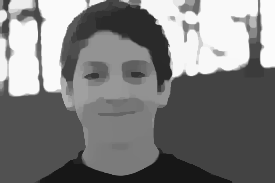
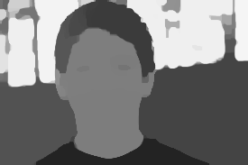
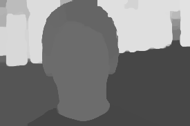
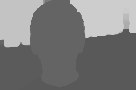

# Retinex-Based Illumination Map Extractor

Structure-preserving illumination map extraction using **Retinex theory** and **L1-regularized optimization** (IRLS).

```
L(x) = R(x) ∘ M(x)   →   M(x) = illumination map,  R(x) = reflectance
```

---

## Installation

```bash
pip install numpy opencv-python scipy
```

---

## Usage

```bash
python retinex_msr.py <input> [options]
```

| Flag | Default | Description |
|---|---|---|
| `--out` | `./output` | Output directory |
| `--alpha` | `0.5` | Smoothing strength (see below) |
| `--iters` | `10` | Max IRLS iterations |
| `--ext` | `.png` | Output file extension |
| `--no-reflectance` | — | Save only the illumination map |

**Examples:**

```bash
# Single image
python retinex_msr.py photo.jpg --alpha 2.0

# Entire folder, illumination map only
python retinex_msr.py ./dataset --out ./results --alpha 1.5 --no-reflectance
```

---

## Choosing Alpha

Alpha controls the trade-off between data fidelity and smoothness:

```
(I  +  α · L_W) m = m̂
 ─               ─────
 keeps m ≈ M̂   forces smooth m
```

| Alpha | Original | Illumination Map |
|:---:|:---:|:---:|
| **0.1** |  |  |
| **0.5** |  |  |
| **2.0** |  |  |
| **5.0** |  |  |

---

## Project Structure

```
.
├── retinex_msr.py   # Illumination map extractor
├── docs/            # Example images
└── output/          # Generated outputs
```

---

## Reference

**LIDeepDet**: *Deepfake Detection via Image Decomposition and Advanced Lighting Information Analysis*, Electronics 2024, 13(22), 4466. [DOI: 10.3390/electronics13224466](https://doi.org/10.3390/electronics13224466)
